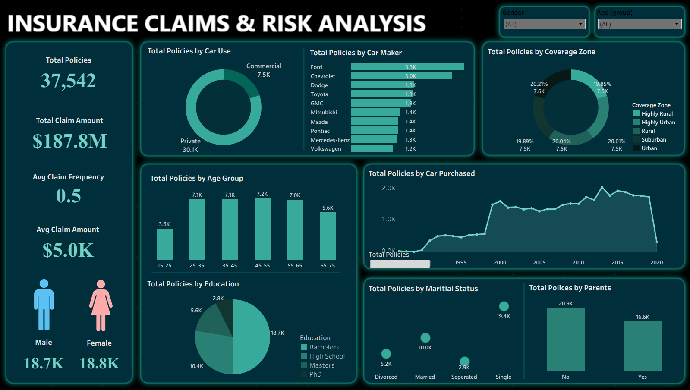
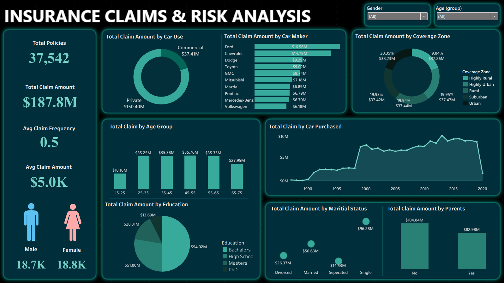

# 🚗 INSURANCE CLAIMS & RISK ANALYSIS DASHBOARD  

## 📌 Introduction  
This project analyzes **insurance policies and claims** to uncover risk patterns across demographics, car types, and regions.  
The dashboards provide a dual perspective:  
1. **Total Policies**  
2. **Total Claim Amount**  

This helps insurers understand both **policy distribution** and **financial exposure**.  

---

## 🛠 Tools Used  
- **Data Visualization:** Tableau / Power BI  
- **Dataset Size:** 37,542 insurance policies  
- **File:** `Insurance_Policies_Data.xlsx`  

---

## 📂 Dataset Information  
The dataset contains insurance policy records with customer demographics, vehicle details, and claim information.  

**Columns include:**  
- `id` → Unique policy identifier  
- `birth_date` → Policyholder’s birth date (used to calculate age group)  
- `car_color` → Vehicle color  
- `car_make` → Manufacturer (e.g., Ford, Chevrolet, Toyota)  
- `car_model` → Specific model of the vehicle  
- `car_use` → Usage type (Private / Commercial)  
- `car_year` → Manufacturing year of the car  
- `coverage_zone` → Policy coverage area (Urban, Rural, Suburban, Highly Urban, Highly Rural)  
- `education` → Education level (High School, Bachelors, Masters, PhD)  
- `gender` → Male / Female  
- `marital_status` → Single, Married, Divorced, Separated  
- `parent` → Indicates if the policyholder has children (Yes / No)  
- `claim_amount` → Total amount claimed under the policy  
- `claim_freq` → Frequency of claims filed  
- `household_income` → Reported household income of policyholder  
- `kids_driving` → Number of kids in household with driving eligibility  

---

## 📊 Key Metrics  
- **Total Policies:** 37,542  
- **Total Claim Amount:** $187.8M  
- **Average Claim Frequency:** 0.5  
- **Average Claim Amount:** $5K  
- **Gender Split:** Male – 18.7K | Female – 18.8K  

---

## 🔎 Analysis by Claim Amount  
1. **Car Use:** Private $150.40M vs Commercial $37.41M  
2. **Car Maker:** Ford ($16.56M), Chevrolet ($14.79M) top claim contributors  
3. **Coverage Zone:** Balanced ($37M–$38M each zone)  
4. **Age Group:** 45–55 ($35.76M), 35–45 ($35.38M) highest claims  
5. **Education:** Bachelors ($94.02M) most claims  
6. **Marital Status:** Single ($96.28M) leads by far  
7. **Parents:** No ($104.84M) vs Yes ($82.98M)  

---

## 📈 Analysis by Policies  
1. **Car Use:** Private (30.1K) vs Commercial (7.5K)  
2. **Car Maker:** Ford (3.3K) & Chevrolet (3.0K) lead  
3. **Coverage Zone:** Evenly spread (~7.5K each zone)  
4. **Age Group:** 35–45 (7.2K), 25–35 (7.1K), 45–55 (7.0K) hold most policies  
5. **Education:** Bachelors (18.7K) dominates  
6. **Marital Status:** Single (19.4K) highest  
7. **Parents:** No (20.9K) vs Yes (16.6K)  

---

## 💡 Insights & Observations  
- Private vehicles dominate both policies and claims  
- Ford & Chevrolet customers generate the most claims  
- Middle-aged policyholders (35–55) are the riskiest segment  
- Singles and Bachelors file the largest claims  
- Risk is evenly spread across zones → no geography-specific bias  
- Non-parents contribute more to claims than parents  

---

## 🏢 Business Impact  
- **Pricing Strategy:** Adjust premiums for high-risk groups (Singles, Bachelors, Ford/Chevrolet owners)  
- **Risk Management:** Zone-based pricing is unnecessary; focus on demographics instead  
- **Product Innovation:** Offer tailored insurance bundles for middle-aged individuals and singles  
- **Profitability:** Identifying high-claim contributors helps insurers manage reserves and reduce loss ratios  

---

## ✅ Conclusion  
The dashboards provide actionable insights by combining **policy distribution** and **claim amount** trends.  
Insurers can use this analysis to enhance **underwriting**, target the **right customer groups**, and reduce **risk exposure**.  

---

## 📊 Dashboard Preview  

  
  
